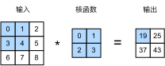
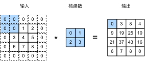
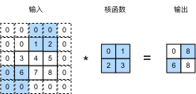
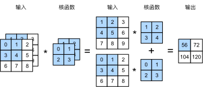
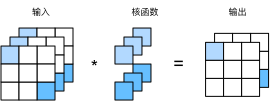
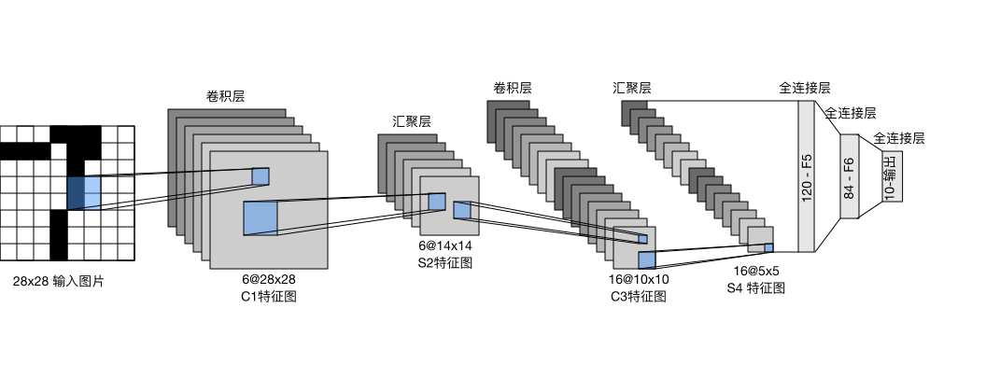

# 卷积神经网络

> [[CS/ML/动手学机器学习v2/00 动手学机器学习v2|返回课程目录]]

## 从全连接到卷积

### 两个原则

- 平移不变性
- 局部性

### 重新考察全连接层

- 将输入和输出变形为矩阵（宽度，高度）
- 将权重变形为 4-D 张量
    $$h_{i,j} = \sum_{k,l} w_{i,j,k,l} x_{k,l} = \sum_{a,b} v_{i,j,a,b} x_{i+a,j+b}$$
- v 是 w 的重新索引 $v_{i,j,a,b} = w_{i,j,i+a,j+b}$
  - 注意这里 a 和 b 表示输入相对于输出的偏移量

### 平移不变性

- x 的平移导致 h 的平移 
- v 不应该依赖于 (i, j)
- 解决方案：$v_{i,j,a,b} = v_{a,b}$
    $$h_{i,j} = \sum_{a,b} v_{a,b} x_{i+a,j+b}$$
- 这就是二维卷积（交叉相关）

### 局部性

- 当评估$h_{i,j}$时，我们不应该使用远离$x_{i,j}$的参数
- 解决方案：当 $|a|,|b| > \Delta$ 时，使得 $v_{a,b} = 0$
    $$h_{i,j} = \sum_{a = -\Delta}^{\Delta} \sum_{b = -\Delta}^{\Delta} v_{a,b} x_{i+a,j+b}$$


**直观理解**
- 卷积只维护一套局部窗口参数，这套参数在任意空间位置共享使用。使用时，根据输入像素相对于当前输出位置的偏移 (a,b)，选择卷积核中对应位置的参数。

---

## 卷积层

### 二维交叉相关


### 二维卷积层
- 输入 $\mathbf{X}$: $n_h \times n_w$
- 核 $\mathbf{W}$: $k_h \times k_w$
- 偏差 $b \in \mathbb{R}$
- 输出 $\mathbf{Y}$: $(n_h - k_h + 1) \times (n_w - k_w + 1)$
- $\mathbf{W}$ 和 b 是可学习的参数

### 交叉相关 vs 卷积

- 二维交叉相关
    $$y_{i,j} = \sum_{a=1}^{h} \sum_{b=1}^{w} w_{a,b} x_{i+a,j+b}$$

- 二维卷积
    $$y_{i,j} = \sum_{a=1}^{h} \sum_{b=1}^{w} w_{-a,-b} x_{i+a,j+b}$$

- 由于对称性，在实际应用中没有区别

---

## 代码实现
```py
import torch
from torch import nn
from d2l import torch as d2l
```
```py
def corr2d(X, K): 
    """计算二维互相关运算"""
    h, w = K.shape
    Y = torch.zeros((X.shape[0] - h + 1, X.shape[1] - w + 1))
    for i in range(Y.shape[0]):
        for j in range(Y.shape[1]):
            Y[i, j] = (X[i:i + h, j:j + w] * K).sum()
    return Y
```
```py
class Conv2D(nn.Module):
    def __init__(self, kernel_size):
        super().__init__()
        self.weight = nn.Parameter(torch.rand(kernel_size))
        self.bias = nn.Parameter(torch.zeros(1))

    def forward(self, x):
        return corr2d(x, self.weight) + self.bias
```

---

## 填充
在输入周围添加额外行和列

- 填充 $p_h$ 行和 $p_w$ 列，输出形状为
    $$(n_h - k_h + 1 + p_h) \times (n_w - k_w + 1 + p_w)$$

- 通常取 $p_h =  k_h - 1$, $p_w = k_w - 1$

## 步幅
步幅指行/列的滑动步长

- 高度3 宽度2 的步幅
- 选择大步幅使输出更快缩小

通常，当垂直步幅为$s_h$、水平步幅为$s_w$时，输出形状为

$$\lfloor(n_h-k_h+p_h+s_h)/s_h\rfloor \times \lfloor(n_w-k_w+p_w+s_w)/s_w\rfloor.$$

如果我们设置了$p_h=k_h-1$和$p_w=k_w-1$，则输出形状将简化为

$$\lfloor(n_h+s_h-1)/s_h\rfloor \times \lfloor(n_w+s_w-1)/s_w\rfloor$$

更进一步，如果输入的高度和宽度可以被垂直和水平步幅整除，则输出形状将为

$$(n_h/s_h) \times (n_w/s_w)$$

## 代码实现

```py
import torch
from torch import nn

conv2d = nn.Conv2d(1, 1, kernel_size=(3, 5), padding=(0, 1), stride=(3, 4))
```
- 实现一个批量大小、通道数均为1，核为3$\times$5，填充为高度方向上上下各为0、宽度方向上左右各为1，步幅为高度方向上3、宽度方向上4的卷积模型


```py
X = torch.rand(size=(8, 8))
X = X.reshape((1, 1) + X.shape)
conv2d(X).shape
```
输出：
```py
torch.Size([1, 1, 2, 2])
```

---

## 通道

### 多个输入通道

- 彩色图像可能有RGB三个通道
- 转换为灰度会丢失信息


- 输入 $\mathbf{X}: \space c_i \times n_h \times n_w$
- 核 $\mathbf{W}: \space c_i \times k_h \times k_w$
- 输出 $\mathbf{Y}: \space m_h \times m_w$
    $$ \mathbf{Y} = \sum_{i = 0}^{c_i} \mathbf{X}_{i,:,:} \star \mathbf{W}_{i,:,:}$$

### 多个输出通道

- 我们可以有多个三维卷积核，每个核生成一个输出通道
- 输入 $\mathbf{X}: \space c_i \times n_h \times n_w$
- 核 $\mathbf{W}: \space c_o \times c_i \times k_h \times k_w$
- 输出 $\mathbf{Y}: \space c_o \times m_h \times m_w$
        $$ \mathbf{Y}_{i,:,:} = \mathbf{X} \star \mathbf{W}_{i,:,:,:} \space \space \space \text{for} \space i = 1, \cdots, c_o$$

### 目的

- 多个输出通道可以识别特定模式
- 输入通道核识别并组合输入中的模式

### 1 $\times$ 1 卷积层



- 不识别空间模式，只融合通道

### 代码实现

```py
import torch
from d2l import torch as d2l
```

多个输入通道
```py
def corr2d_multi_in(X, K):
    # 先遍历“X”和“K”的第0个维度（通道维度），再把它们加在一起
    return sum(d2l.corr2d(x, k) for x, k in zip(X, K))
```
- corr2d() 在[[CS/ML/动手学机器学习v2/05 卷积神经网络#代码实现|5.3]]中实现过存入过该课程的d2l包

多个输出通道
```py
def corr2d_multi_in_out(X, K):
    # 迭代“K”的第0个维度，每次都对输入“X”执行互相关运算。
    # 最后将所有结果都叠加在一起
    return torch.stack([corr2d_multi_in(X, k) for k in K], 0)
```

---

## 池化层

### 二维最大池化
- 返回滑动窗口中的最大值


### 填充，步幅和多个通道
- 池化层与卷积类似，都具有填充和步幅
- 没有可以学习的参数
- 在每个输入通道应用池化层以获得相应的输出通道
- 输出通道数 = 输出通道数

### 平均池化层
- 最大池化层: 每个窗口中最强的模式信号
- 平均池化层：将最大池化层中的“最大”操作替换为“平均”

### 目的
- 通常作用在卷积层之后
- 用于缓解卷积敏感性

### 具体实现
```py
import torch
from torch import nn
```
```py
def pool2d(X, pool_size, mode='max'):
    p_h, p_w = pool_size
    Y = torch.zeros((X.shape[0] - p_h + 1, X.shape[1] - p_w + 1))
    for i in range(Y.shape[0]):
        for j in range(Y.shape[1]):
            if mode == 'max':
                Y[i, j] = X[i: i + p_h, j: j + p_w].max()
            elif mode == 'avg':
                Y[i, j] = X[i: i + p_h, j: j + p_w].mean()
    return Y
```

---

## LeNet



### 代码实现

```py
import torch
from torch import nn

net = nn.Sequential(
    nn.Conv2d(1, 6, kernel_size=5, padding=2), nn.Sigmoid(),
    nn.AvgPool2d(kernel_size=2, stride=2),
    nn.Conv2d(6, 16, kernel_size=5), nn.Sigmoid(),
    nn.AvgPool2d(kernel_size=2, stride=2),
    nn.Flatten(),
    nn.Linear(16 * 5 * 5, 120), nn.Sigmoid(),
    nn.Linear(120, 84), nn.Sigmoid(),
    nn.Linear(84, 10))
```
- 去掉了最后一层高斯激活
