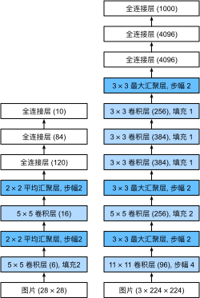
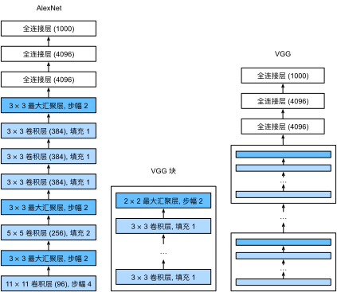
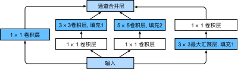
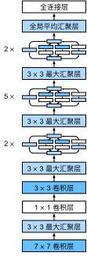
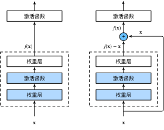
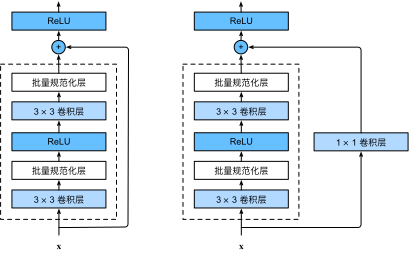
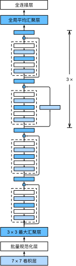

# 现代卷积神经网络

> [返回课程目录](00%20动手学机器学习v2.md)

## AlexNet（深度卷积神经网络）

- 更深更大的LeNet
- 主要改进
  - 丢弃法
  - ReLU
  - MaxPooling
- 计算机视觉方法论的改变
  - 特征不应该由人手工设计，而应该由神经网络自己学习
  - AlexNet 是一个端到端系统
    - 原始像素 → 多层卷积网络 → 图像类别

### AlexNet vs LeNet


### 代码实现
```py
import torch
from torch import nn

net = nn.Sequential(
    # 这里使用一个11*11的更大窗口来捕捉对象。
    # 同时，步幅为4，以减少输出的高度和宽度。
    # 另外，输出通道的数目远大于LeNet
    # 这里使用Fashion-MNIST，故通道数为1
    nn.Conv2d(1, 96, kernel_size=11, stride=4, padding=1), nn.ReLU(),
    nn.MaxPool2d(kernel_size=3, stride=2),
    # 减小卷积窗口，使用填充为2来使得输入与输出的高和宽一致，且增大输出通道数
    nn.Conv2d(96, 256, kernel_size=5, padding=2), nn.ReLU(),
    nn.MaxPool2d(kernel_size=3, stride=2),
    # 使用三个连续的卷积层和较小的卷积窗口。
    # 除了最后的卷积层，输出通道的数量进一步增加。
    # 在前两个卷积层之后，汇聚层不用于减少输入的高度和宽度
    nn.Conv2d(256, 384, kernel_size=3, padding=1), nn.ReLU(),
    nn.Conv2d(384, 384, kernel_size=3, padding=1), nn.ReLU(),
    nn.Conv2d(384, 256, kernel_size=3, padding=1), nn.ReLU(),
    nn.MaxPool2d(kernel_size=3, stride=2),
    nn.Flatten(),
    # 这里，全连接层的输出数量是LeNet中的好几倍。使用dropout层来减轻过拟合
    nn.Linear(6400, 4096), nn.ReLU(),
    nn.Dropout(p=0.5),
    nn.Linear(4096, 4096), nn.ReLU(),
    nn.Dropout(p=0.5),
    # 最后是输出层。由于这里使用Fashion-MNIST，所以用类别数为10，而非论文中的1000
    nn.Linear(4096, 10))
```

---

## VGG（使用块的网络）

### VGG 架构
- VGG 块
  - 3 $\times$ 3 卷积（填充1）（n层，m通道）
  - 2 $\times$ 2 最大池化层（步幅2）

- 多个VGG块后连接全连接层

### VGG vs AlexNet

- VGG  →  更大更深更整齐的AlexNet

### 代码实现
```py
import torch
from torch import nn

def vgg_block(num_convs, in_channels, out_channels):
    layers = []
    for _ in range(num_convs):
        layers.append(nn.Conv2d(in_channels, out_channels,
                                kernel_size=3, padding=1))
        layers.append(nn.ReLU())
        in_channels = out_channels
    layers.append(nn.MaxPool2d(kernel_size=2,stride=2))
    return nn.Sequential(*layers)
```

VGG-11
```py
def vgg(conv_arch):
    conv_blks = []
    in_channels = 1
    # 卷积层部分
    for (num_convs, out_channels) in conv_arch:
        conv_blks.append(vgg_block(num_convs, in_channels, out_channels))
        in_channels = out_channels

    return nn.Sequential(
        *conv_blks, nn.Flatten(),
        # 全连接层部分
        nn.Linear(out_channels * 7 * 7, 4096), nn.ReLU(), nn.Dropout(0.5),
        nn.Linear(4096, 4096), nn.ReLU(), nn.Dropout(0.5),
        nn.Linear(4096, 10))
```
```py
conv_arch = ((1, 64), (1, 128), (2, 256), (2, 512), (2, 512))
net = vgg(conv_arch)
```

---

## NiN （网络中的网络）

### 全连接层的问题

- 卷积层需要较少的参数 $ c_i \times c_o \times k^2$
- 但卷积层后的第一个全连接层的参数很多
  - 占用空间很大
  - 使用很多带宽
  - 容易过拟合

### NiN块
- 一个卷积层后跟两个（全连接层）
  - 步幅1，无填充，输出形状跟卷积层输出一样
  - 起到全连接层的作用

### NiN架构
- 无全连接层
- 交替使用NiN块和步幅为2的最大池化层
  - 逐步减小高宽和增大通道数
- 最后使用全局平均池化层得到输出
  - 其输入通道数是类别数

### NiN vs VGG


### 代码实现

```py
import torch
from torch import nn
```
```py
def nin_block(in_channels, out_channels, kernel_size, strides, padding):
    return nn.Sequential(
        nn.Conv2d(in_channels, out_channels, kernel_size, strides, padding),
        nn.ReLU(),
        nn.Conv2d(out_channels, out_channels, kernel_size=1), nn.ReLU(),
        nn.Conv2d(out_channels, out_channels, kernel_size=1), nn.ReLU())
```
```py
net = nn.Sequential(
    nin_block(1, 96, kernel_size=11, strides=4, padding=0),
    nn.MaxPool2d(3, stride=2),
    nin_block(96, 256, kernel_size=5, strides=1, padding=2),
    nn.MaxPool2d(3, stride=2),
    nin_block(256, 384, kernel_size=3, strides=1, padding=1),
    nn.MaxPool2d(3, stride=2),
    nn.Dropout(0.5),
    # 标签类别数是10
    nin_block(384, 10, kernel_size=3, strides=1, padding=1),
    nn.AdaptiveAvgPool2d((1, 1)),
    # 将四维的输出转成二维的输出，其形状为(批量大小,10)
    nn.Flatten())
```

---

## GoogLeNet （含并行连结的网络）

### Inception块

- 与单 $3 \times 3$ 和 $5 \times 5$ 相比，Inception块有更少的参数和计算复杂度

### GoogLeNet


### 代码实现
```py
import torch
from torch import nn
from torch.nn import functional as F

class Inception(nn.Module):
    # c1--c4是每条路径的输出通道数
    def __init__(self, in_channels, c1, c2, c3, c4, **kwargs):
        super(Inception, self).__init__(**kwargs)
        # 线路1，单1x1卷积层
        self.p1_1 = nn.Conv2d(in_channels, c1, kernel_size=1)
        # 线路2，1x1卷积层后接3x3卷积层
        self.p2_1 = nn.Conv2d(in_channels, c2[0], kernel_size=1)
        self.p2_2 = nn.Conv2d(c2[0], c2[1], kernel_size=3, padding=1)
        # 线路3，1x1卷积层后接5x5卷积层
        self.p3_1 = nn.Conv2d(in_channels, c3[0], kernel_size=1)
        self.p3_2 = nn.Conv2d(c3[0], c3[1], kernel_size=5, padding=2)
        # 线路4，3x3最大汇聚层后接1x1卷积层
        self.p4_1 = nn.MaxPool2d(kernel_size=3, stride=1, padding=1)
        self.p4_2 = nn.Conv2d(in_channels, c4, kernel_size=1)

    def forward(self, x):
        p1 = F.relu(self.p1_1(x))
        p2 = F.relu(self.p2_2(F.relu(self.p2_1(x))))
        p3 = F.relu(self.p3_2(F.relu(self.p3_1(x))))
        p4 = F.relu(self.p4_2(self.p4_1(x)))
        # 在通道维度上连结输出
        return torch.cat((p1, p2, p3, p4), dim=1)
```

```py
b1 = nn.Sequential(nn.Conv2d(1, 64, kernel_size=7, stride=2, padding=3),
                   nn.ReLU(),
                   nn.MaxPool2d(kernel_size=3, stride=2, padding=1))
```
```py
b2 = nn.Sequential(nn.Conv2d(64, 64, kernel_size=1),
                   nn.ReLU(),
                   nn.Conv2d(64, 192, kernel_size=3, padding=1),
                   nn.ReLU(),
                   nn.MaxPool2d(kernel_size=3, stride=2, padding=1))
```
```py
b3 = nn.Sequential(Inception(192, 64, (96, 128), (16, 32), 32),
                   Inception(256, 128, (128, 192), (32, 96), 64),
                   nn.MaxPool2d(kernel_size=3, stride=2, padding=1))
```
```py
b4 = nn.Sequential(Inception(480, 192, (96, 208), (16, 48), 64),
                   Inception(512, 160, (112, 224), (24, 64), 64),
                   Inception(512, 128, (128, 256), (24, 64), 64),
                   Inception(512, 112, (144, 288), (32, 64), 64),
                   Inception(528, 256, (160, 320), (32, 128), 128),
                   nn.MaxPool2d(kernel_size=3, stride=2, padding=1))
```
```py
b5 = nn.Sequential(Inception(832, 256, (160, 320), (32, 128), 128),
                   Inception(832, 384, (192, 384), (48, 128), 128),
                   nn.AdaptiveAvgPool2d((1,1)),
                   nn.Flatten())
```
```
net = nn.Sequential(b1, b2, b3, b4, b5, nn.Linear(1024, 10))
```

---

## 批量归一化
- 固定小批量中的均值和方差，然后学习出适合的偏移和缩放
- 可以加速收敛速度（可以适当调大学习率），但一般不改变模型精度

### 实际问题
- 损失出现在最后，后面的层训练较快
- 数据在最底部
  - 底部的层训练较慢
  - 底部层一变化，所有都得跟着变
  - 最后的那些层需要重新学习很多层
  - 导致收敛变慢

### 批量归一化
- 固定小批量里的均值和方差
    $$
    \mu_B = \frac{1}{|B|}\sum_{i \in B}x_i \space \text{and} \space \sigma_B^2 = \frac{1}{|B|}\sum_{i \in B}(x_i - \mu_B)^2 +  \epsilon
    $$
- 然后再做额外的调整
    $$
    x_{i+1} = \gamma \frac{x_i - \mu_B}{\sigma_B} + \beta
    $$
  - 可学习的参数为 $\gamma$ 和 $\beta$
  - 作用在
    - 全连接层和卷积层的输出上，激活函数前
    - 全连接层和卷积层的输入上
  - 对于全连接层，作用在特征维
  - 对于卷积层，作用在通道维

### 批量归一化在做什么
- 最初论文是想用它来减少内部协变量转移
- 后续有论文指出它可能就是通过在每个小批量里加入噪音来控制模型复杂度
- 因此没有必要和丢弃法混用

---

## ResNet（残差网络）
- 允许信息直接跳过某些层，处理块只负责学习“需要改变的部分”

### 残差块
- 串联一个层改变函数类，我们希望能扩大函数类
- 残差块加入快速通道来得到 $f(x) = x + g(x)$ 的结构



### 残差块具体实现



### ResNet模型



### 代码实现

```py
import torch
from torch import nn
from torch.nn import functional as F
```
```py
class Residual(nn.Module): 
    def __init__(self, input_channels, num_channels,
                 use_1x1conv=False, strides=1):
        super().__init__()
        self.conv1 = nn.Conv2d(input_channels, num_channels,
                               kernel_size=3, padding=1, stride=strides)
        self.conv2 = nn.Conv2d(num_channels, num_channels,
                               kernel_size=3, padding=1)
        if use_1x1conv:
            self.conv3 = nn.Conv2d(input_channels, num_channels,
                                   kernel_size=1, stride=strides)
        else:
            self.conv3 = None
        self.bn1 = nn.BatchNorm2d(num_channels)
        self.bn2 = nn.BatchNorm2d(num_channels)

    def forward(self, X):
        Y = F.relu(self.bn1(self.conv1(X)))
        Y = self.bn2(self.conv2(Y))
        if self.conv3:
            X = self.conv3(X)
        Y += X      # important for resnet
        return F.relu(Y)
```
```py
# big block, just like a stage
def resnet_block(input_channels, num_channels, num_residuals,
                 first_block=False):
    blk = []
    for i in range(num_residuals):
        if i == 0 and not first_block:
            blk.append(Residual(input_channels, num_channels,
                                use_1x1conv=True, strides=2))
        else:
            blk.append(Residual(num_channels, num_channels))
    return blk
```
```py
b1 = nn.Sequential(nn.Conv2d(1, 64, kernel_size=7, stride=2, padding=3),
                   nn.BatchNorm2d(64), nn.ReLU(),
                   nn.MaxPool2d(kernel_size=3, stride=2, padding=1))
b2 = nn.Sequential(*resnet_block(64, 64, 2, first_block=True))
b3 = nn.Sequential(*resnet_block(64, 128, 2))
b4 = nn.Sequential(*resnet_block(128, 256, 2))
b5 = nn.Sequential(*resnet_block(256, 512, 2))
net = nn.Sequential(b1, b2, b3, b4, b5,
                    nn.AdaptiveAvgPool2d((1,1)),
                    nn.Flatten(), nn.Linear(512, 10))
```
