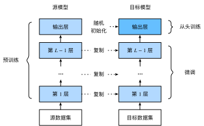
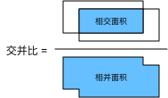
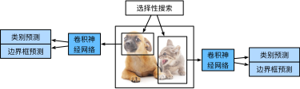
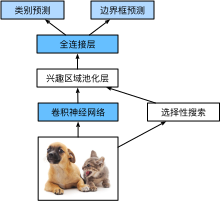
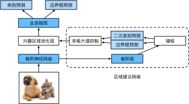
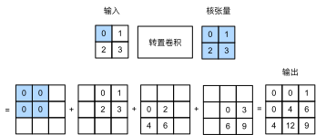
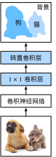

# 计算机视觉

> [返回课程目录](00%20动手学机器学习v2.md)

## 数据增广
增加一个已有数据集，使得有更多的多样性
  - 在语言里面加入各种不同的背景噪音
  - 改变图像的颜色和形状

### 使用增强数据训练
- 对原始数据随机在线生成增强后数据（训练时）

### 常见增强
- 翻转
  - 左右翻转
  - 上下翻转
    - 不总是可行
- 切割
  - 从图片中切割一块吗，然后变形到固定形状
    - 随机高宽比
    - 随机大小
    - 随机位置
- 颜色
  - 改变色调，饱和度，明亮度

---

## 微调
- 迁移学习常用方法
- 通过使用在大数据上得到的预训练好的模型来初始化模型权重来完成提升精度
- 预训练模型质量很重要
- 微调通常速度更快、精度更高

### 网络架构
- 一个神经网络一般可以分成两块
  - 特征抽取将原始像素变成容易线性分割的特征
  - 线性分类器来做分类

### 微调

1. 在源数据集（例如ImageNet数据集）上预训练神经网络模型，即*源模型*。
1. 创建一个新的神经网络模型，即*目标模型*。这将复制源模型上的所有模型设计及其参数（输出层除外）。我们假定这些模型参数包含从源数据集中学到的知识，这些知识也将适用于目标数据集。我们还假设源模型的输出层与源数据集的标签密切相关；因此不在目标模型中使用该层。
1. 向目标模型添加输出层，其输出数是目标数据集中的类别数。然后随机初始化该层的模型参数。
1. 在目标数据集（如椅子数据集）上训练目标模型。输出层将从头开始进行训练，而所有其他层的参数将根据源模型的参数进行微调。



### 训练
- 是一个目标数据集上的正常训练任务，但使用更强的正则化
  - 使用更小的学习率
  - 使用更小的数据迭代
- 源数据集原复杂于目标数据，通常微调效果更好

### 重用分类器权重
- 源数据集可能也有目标数据中的部分标号
- 可以使用预训练好的模型分类器中对应标号对应向量来做初始化

### 固定一些层
- 神经网络通常学习有层次的特征表示
  - 低层次的特征更加通用
  - 高层次的特征则跟数据集相关
- 可以固定底部一些层的参数，不参与更新
  - 更强的正则

---

## 目标检测

### 边缘框
- 一个边缘框可以通过四个数字定义
  - （左上x，左上y，右下x，右下y）
  - （左上x，左上y，宽，高）

### 目标检测数据集
- 每行表示一个物体
  - 图片文件名，物体类别，边缘框

---

## 锚框
- 提出多个被称为锚框的区域
- 预测每个锚框里是否有关注的物体
- 如果是，预测从这个锚框到真实边缘框的偏移


### loU - 交并比
- loU用来计算两个框之间的相似度
  - 0表示为无重叠，1表示重合
- 这是Jacquard指数的一个特殊情况
  - 给定两个集合A和B
    $$
    J(A,B) = \frac{|A\cap B|}{|A\cup B|}
    $$


### 在训练数据中标注锚框

#### 赋予锚框标号

- 每个锚框是一个训练样本
- 将每个锚框，要么标注成背景，要么关联上一个真实边缘框
- 可能会生成大量的锚框
  - 这个导致的大量的负类的样本

#### 将真实边界框分配给锚框

给定图像，假设锚框是$A_1, A_2, \ldots, A_{n_a}$，真实边界框是$B_1, B_2, \ldots, B_{n_b}$，其中$n_a \geq n_b$。
让我们定义一个矩阵$\mathbf{X} \in \mathbb{R}^{n_a \times n_b}$，其中第$i$行、第$j$列的元素$x_{ij}$是锚框$A_i$和真实边界框$B_j$的IoU。
该算法包含以下步骤。

1. 在矩阵$\mathbf{X}$中找到最大的元素，并将它的行索引和列索引分别表示为$i_1$和$j_1$。然后将真实边界框$B_{j_1}$分配给锚框$A_{i_1}$。这很直观，因为$A_{i_1}$和$B_{j_1}$是所有锚框和真实边界框配对中最相近的。在第一个分配完成后，丢弃矩阵中${i_1}^\mathrm{th}$行和${j_1}^\mathrm{th}$列中的所有元素。
1. 在矩阵$\mathbf{X}$中找到剩余元素中最大的元素，并将它的行索引和列索引分别表示为$i_2$和$j_2$。我们将真实边界框$B_{j_2}$分配给锚框$A_{i_2}$，并丢弃矩阵中${i_2}^\mathrm{th}$行和${j_2}^\mathrm{th}$列中的所有元素。
1. 此时，矩阵$\mathbf{X}$中两行和两列中的元素已被丢弃。我们继续，直到丢弃掉矩阵$\mathbf{X}$中$n_b$列中的所有元素。此时已经为这$n_b$个锚框各自分配了一个真实边界框。
1. 只遍历剩下的$n_a - n_b$个锚框。例如，给定任何锚框$A_i$，在矩阵$\mathbf{X}$的第$i^\mathrm{th}$行中找到与$A_i$的IoU最大的真实边界框$B_j$，只有当此IoU大于预定义的阈值时，才将$B_j$分配给$A_i$。


**理解**
- 很多 anchor 在“抢”几个真实框。
- 第一轮先保证：
  - 每个真实框至少有一个最合适的 anchor 负责。
- 第二轮再让：
  - 其他 IoU 足够高的 anchor 也加入负责真实框。
- 剩下 IoU 太低的 anchor 就当背景。

### 非极大值抑制（NMS）
- 每个锚框预测一个边缘框
- NMS可以合并相似的预测
  - 选中是非背景类的最大预测值
  - 去掉所有其他和它loU值大于$\theta$的预测
  - 重复上述过程知道所有预测要么被选中，要么被去掉

---

## 区域卷积神经网络

### R-CNN
- 使用启发式搜索算法来选择锚框
- 使用预训练模型来对每个锚框抽取特征
- 训练一个SVM来对类别分类
- 训练一个线性回归模型来预测边缘框偏移


#### 兴趣区域（RoI）池化层
- 给定一个锚框，均匀分割成 $n \times m$ 块，输出每块里的最大值
- 不管锚框多大，总是输出 $ nm $ 个值

RoI 池化 = 把任意大小的候选框特征，压成固定大小的特征表格


### Fast R-CNN
与R-CNN相比，Fast R-CNN用来提取特征的卷积神经网络的输入是整个图像，而不是各个提议区域


### Faster R-CNN
- 使用一个区域提议网络来替代启发式搜索获得更好的锚框


### Mask R-CNN
- 如果有像素级别的标号，使用FCN来利用这些信息


---

## 单发多框检测（SSD）

### 生成锚框
- 对每个像素，生成多个以它为中心的锚框

### SSD模型
- 一个基础网络来抽取特征，然后多个卷积层块来减半高宽
- 在每段都生成锚框
  - 底部段来拟合小物体，顶部段来拟合大物体
- 对每个锚框预测类别和边缘框


---

## YOLO
- SSD中锚框大量重叠，因此浪费了很多计算
- YOLO将图片均匀分成 $ S \times S $ 个锚框
- 每个锚框预测 $ B $ 个边缘框

---

## 语义分割
- 语义分割将图片中的每个像素分类到对应的类别

### 应用
- 背景虚化
- 路面分割

### 图像分割 和 实例分割
- 图像分割
  - 不需要有关图像像素的标签信息，在预测时也无法保证分割出的区域具有我们希望得到的语义
- 实例分割
  - 实例分割不仅需要区分语义，还要区分不同的目标实例

## 语义分割数据集
- 最重要的语义分割数据集之一是 Pascal VOC2012

---

## 转置卷积
- 卷积不会增大输入的高宽，通常要么不变、要么减半
- 转置卷积则可以用来增大输入高宽

### 基本操作


### 代码实现
```py 
import torch
from torch import nn
```
**实现基本的转置卷积运算**
```py
def trans_conv(X, K):
    h, w = K.shape
    Y = torch.zeros((X.shape[0] + h - 1, X.shape[1] + w - 1))
    for i in range(X.shape[0]):
        for j in range(X.shape[1]):
            Y[i: i + h, j: j + w] += X[i, j] * K
    return Y
```
**填充、步幅和多通道**
- 与常规卷积不同，在转置卷积中，填充被应用于的输出（常规卷积将填充应用于输入）。 例如，当将高和宽两侧的填充数指定为1时，转置卷积的输出中将删除第一和最后的行与列。

---

## FCN
全连接卷积神经网络
- FCN是用深度神经网络做语义分割的奠基性工具
- 它用转置卷积层来替换CNN最后的全连接层，从而可以实现每个像素的预测



---

## 样式迁移
- 将样式图片中的样式迁移到内容图片上，得到合成图片

### 基于CNN的样式迁移

