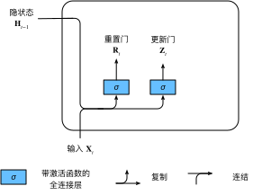
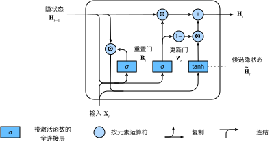
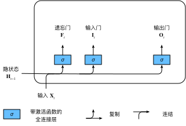
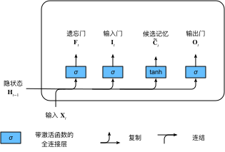
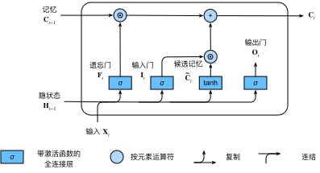
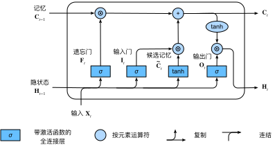
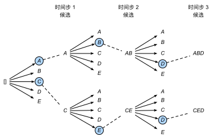

# 现代循环神经网络

> [返回课程目录](00%20动手学机器学习v2.md)

## GRU（门控循环单元）

### 关注一个序列
- 不是每个观察值都是同等重要
- 想只记住相关的观察需要：
  - 能关注的机制（更新门）
  - 能遗忘的机制（重制门）

### 重制门 更新门

$$
\begin{aligned}
\mathbf{R}_t = \sigma(\mathbf{X}_t \mathbf{W}_{xr} + \mathbf{H}_{t-1} \mathbf{W}_{hr} + \mathbf{b}_r)\\
\mathbf{Z}_t = \sigma(\mathbf{X}_t \mathbf{W}_{xz} + \mathbf{H}_{t-1} \mathbf{W}_{hz} + \mathbf{b}_z)
\end{aligned}
$$



### 候选隐状态

$$
\tilde{\mathbf{H}}_t = \tanh(\mathbf{X}_t \mathbf{W}_{xh} + \left(\mathbf{R}_t \odot \mathbf{H}_{t-1}\right) \mathbf{W}_{hh} + \mathbf{b}_h)
$$


- 这里由于 $\mathbf{R}_t$ 使用 sigmoid激活函数，矩阵中元素均属于0到1
- 与前一个隐状态 `Hadamard积` 后有些值变0 $\rightarrow$ 重制门

### 隐状态

$$
\mathbf{H}_t = \mathbf{Z}_t \odot \mathbf{H}_{t-1}  + (1 - \mathbf{Z}_t) \odot \tilde{\mathbf{H}}_t
$$



- 当更新门$\mathbf{Z}_t$接近$1$时，模型就倾向只保留旧状态
- 当$\mathbf{Z}_t$接近$0$时，新的隐状态$\mathbf{H}_t$就会接近候选隐状态$\tilde{\mathbf{H}}_t$

---

## LSTM （长短期记忆网络）

LSTM 的记忆单元 $\mathbf{C}_t$ 允许信息沿着加法通路流动，理论上可以无限变大，但它受到遗忘门、输入门、候选值范围和训练目标共同控制；正因为它不被强行压缩，所以能更好地保留长期记忆。

### 门

$$
\begin{aligned}
\mathbf{I}_t &= \sigma(\mathbf{X}_t \mathbf{W}_{xi} + \mathbf{H}_{t-1} \mathbf{W}_{hi} + \mathbf{b}_i)\\
\mathbf{F}_t &= \sigma(\mathbf{X}_t \mathbf{W}_{xf} + \mathbf{H}_{t-1} \mathbf{W}_{hf} + \mathbf{b}_f)\\
\mathbf{O}_t &= \sigma(\mathbf{X}_t \mathbf{W}_{xo} + \mathbf{H}_{t-1} \mathbf{W}_{ho} + \mathbf{b}_o)
\end{aligned}
$$



- 输入门： 决定不是忽略掉输入数据
- 忘记门： 将值超0减少
- 输出门： 决定是不是使用隐状态

### 候选记忆单元

$$
\tilde{\mathbf{C}}_t = \text{tanh}(\mathbf{X}_t \mathbf{W}_{xc} + \mathbf{H}_{t-1} \mathbf{W}_{hc} + \mathbf{b}_c)
$$



### 记忆单元

$$
\mathbf{C}_t = \mathbf{F}_t \odot \mathbf{C}_{t-1} + \mathbf{I}_t \odot \tilde{\mathbf{C}}_t
$$



### 隐状态

$$
\mathbf{H}_t = \mathbf{O}_t \odot \tanh(\mathbf{C}_t).
$$



---

## Deep-RNN（深度循环神经网络）

使用多个隐藏层来获得更多的非线形性

### 更深


$$
\mathbf{H}_t^{(l)} = \phi_l(\mathbf{H}_t^{(l-1)} \mathbf{W}_{xh}^{(l)} + \mathbf{H}_{t-1}^{(l)} \mathbf{W}_{hh}^{(l)}  + \mathbf{b}_h^{(l)})
$$

---

## bi-RNN（双向循环神经网络）
- 双向循环神经网络通过反向更新隐藏层利用方向时间信息
- 通常用来对序列抽取特征、填空，而不是预测未来

### 未来很重要
- 取决于过去和未来的上下文，可以填很不一样的词
- 在填空的时候我们也可以看未来

### 双向RNN


$$
\begin{aligned}
\overrightarrow{\mathbf{H}}_t &= \phi(\mathbf{X}_t \mathbf{W}_{xh}^{(f)} + \overrightarrow{\mathbf{H}}_{t-1} \mathbf{W}_{hh}^{(f)}  + \mathbf{b}_h^{(f)})\\
\overleftarrow{\mathbf{H}}_t &= \phi(\mathbf{X}_t \mathbf{W}_{xh}^{(b)} + \overleftarrow{\mathbf{H}}_{t+1} \mathbf{W}_{hh}^{(b)}  + \mathbf{b}_h^{(b)})
\end{aligned}
$$

$$
\mathbf{H}_t = [\overrightarrow{\mathbf{H}}_{t}, \overleftarrow{\mathbf{H}}_t]
$$

$$
\mathbf{O}_t = \mathbf{H}_t \mathbf{W}_{hq} + \mathbf{b}_q
$$

- 一个前向RNN隐层
- 一个反向RNN隐层
- 合并两个隐状态得到输出

---

## 机器翻译与数据集

- 机器翻译指的是将文本序列从一种语言自动翻译成另一种语言
- 使用单词级词元化时的词表大小，将明显大于使用字符级词元化时的词表大小。为了缓解这一问题，我们可以将低频词元视为相同的未知词元
- 通过截断和填充文本序列，可以保证所有的文本序列都具有相同的长度，以便以小批量的方式加载

---

## 编码器与解码器

### 编码器-解码器架构

*编码器-解码器*（encoder-decoder）架构：
- 第一个组件是一个*编码器*（encoder）：
  - 它接受一个长度可变的序列作为输入，并将其转换为具有固定形状的编码状态
- 第二个组件是*解码器*（decoder）：
  - 它将固定形状的编码状态映射到长度可变的序列


---

## seq2seq（序列到序列学习）

### seq2seq


- 编码器是一个RNN，读取输入句子
  - 可以是双向
- 解码器使用另外一个RNN输出

### 编码器-解码器细节


- 编码器是没有输出的RNN
- 编码器最后时间步的隐状态用作解码器的初始状态

### 具体实现

```py
import collections
import math
import torch
from torch import nn
from d2l import torch as d2l
```

#### 编码器类
```py
class Seq2SeqEncoder(d2l.Encoder):
    """用于序列到序列学习的循环神经网络编码器"""
    def __init__(self, vocab_size, embed_size, num_hiddens, num_layers, dropout=0, **kwargs):
        super(Seq2SeqEncoder, self).__init__(**kwargs)
        # 嵌入层
        self.embedding = nn.Embedding(vocab_size, embed_size)
        self.rnn = nn.GRU(embed_size, num_hiddens, num_layers,
                          dropout=dropout)

    def forward(self, X, *args):
        # 输出'X'的形状：(batch_size,num_steps,embed_size)
        X = self.embedding(X)
        # 在循环神经网络模型中，第一个轴对应于时间步
        X = X.permute(1, 0, 2)
        # 如果未提及状态，则默认为0
        output, state = self.rnn(X)
        # output的形状:(num_steps,batch_size,num_hiddens)
        # state的形状:(num_layers
```
- embedding：词元 -> 较短、稠密、可训练的实数向量
- nn.GRU 运算返回一个 tuple
  - output 把每个时间步的最后一层隐状态沿着时间维堆起来
  - state 把最后一个时间步的每一层隐状态沿着层数维堆起来

#### 解码器类
```py
class Seq2SeqDecoder(d2l.Decoder):
    """用于序列到序列学习的循环神经网络解码器"""
    def __init__(self, vocab_size, embed_size, num_hiddens, num_layers, dropout=0, **kwargs):
        super(Seq2SeqDecoder, self).__init__(**kwargs)
        self.embedding = nn.Embedding(vocab_size, embed_size)
        self.rnn = nn.GRU(embed_size + num_hiddens, num_hiddens, num_layers,
                          dropout=dropout)
        self.dense = nn.Linear(num_hiddens, vocab_size)

    def init_state(self, enc_outputs, *args):
        return enc_outputs[1]

    def forward(self, X, state):
        # 输出'X'的形状：(batch_size,num_steps,embed_size)

        # 先把时间轴提前
        X = self.embedding(X).permute(1, 0, 2)
        # 广播context，使其具有与X相同的num_steps
        # state[-1].shape = (batch_size,num_hiddens)
        context = state[-1].repeat(X.shape[0], 1, 1)
        # context.shape = (num_steps,batch_size,num_hiddens)        
        X_and_context = torch.cat((X, context), 2)
        # (num_steps,batch_size,embed_size+num_hiddens)
        output, state = self.rnn(X_and_context, state)
        output = self.dense(output).permute(1, 0, 2)
        # output的形状:(batch_size,num_steps,vocab_size)
        # state的形状:(num_layers,batch_size,num_hiddens)
        
        return output, state
```
- init_state 拿的 enc_outputs 是 encoder 返回的 tuple (output, state)
- 注意这里 GRU 输入大小为 embed_size + num_hiddens

#### 损失函数
```py
def sequence_mask(X, valid_len, value=0):
    """在序列中屏蔽不相关的项"""
    # X.shape = (batch_size,num_steps)
    maxlen = X.size(1)
    mask = torch.arange((maxlen), dtype=torch.float32,
                        device=X.device)[None, :] < valid_len[:, None]
    X[~mask] = value
    return X
```

```py
class MaskedSoftmaxCELoss(nn.CrossEntropyLoss):
    """带遮蔽的softmax交叉熵损失函数"""
    # pred的形状：(batch_size,num_steps,vocab_size)
    # label的形状：(batch_size,num_steps)
    # valid_len的形状：(batch_size,)
    def forward(self, pred, label, valid_len):
        weights = torch.ones_like(label)
        weights = sequence_mask(weights, valid_len)
        self.reduction='none'
        unweighted_loss = super(MaskedSoftmaxCELoss, self).forward(
            pred.permute(0, 2, 1), label)
        weighted_loss = (unweighted_loss * weights).mean(dim=1)
        return weighted_loss
```

#### 训练
- 训练时解码器使用目标句子作为输入

#### BLEU
衡量生成序列的好坏
- $p_n$ 是预测中所有 n-gram 的精度
  - 如标签序列 $A\space B\space C\space D\space E\space F\space$ 和预测序列 $A\space B\space B\space C\space D\space$
  - $p_1 = 4/5 \space \space \space p_2 = 3/4 \space \space \space p_3 = 1/3 \space \space \space p_4 = 0$

<br>

- BLUE 定义
$$
\exp\left(\min\left(0, 1 - \frac{\mathrm{len}_{\text{label}}}{\mathrm{len}_{\text{pred}}}\right)\right) \prod_{n=1}^k p_n^{1/2^n}
$$

- BLUE 范围为（0，1），越大越好
- min目的是惩罚过短的预测
- 后项累乘长匹配有高权重

```py
def bleu(pred_seq, label_seq, k): 
    """计算BLEU"""
    pred_tokens, label_tokens = pred_seq.split(' '), label_seq.split(' ')
    len_pred, len_label = len(pred_tokens), len(label_tokens)
    score = math.exp(min(0, 1 - len_label / len_pred))
    for n in range(1, k + 1):
        num_matches, label_subs = 0, collections.defaultdict(int)
        for i in range(len_label - n + 1):
            label_subs[' '.join(label_tokens[i: i + n])] += 1
        for i in range(len_pred - n + 1):
            if label_subs[' '.join(pred_tokens[i: i + n])] > 0:
                num_matches += 1
                label_subs[' '.join(pred_tokens[i: i + n])] -= 1
        score *= math.pow(num_matches / (len_pred - n + 1), math.pow(0.5, n))
    return score
```

---

## 束搜索
贪心搜索找一条候选序列；穷举搜索考虑所有候选序列；束搜索保留多个候选序列，在计算量可接受的情况下更接近全局最优

### 贪心搜索
- 在seq2seq中我们使用了贪心搜索来预测序列
  - 将当前时刻预测概率最大的词输出
- 但贪心很可能不是最优的，当前最优不一定导致整体最优

### 穷举搜索
- 最优算法：对所有可能的序列，计算它的概率，然后选取最好的那个
- 但是计算上不可能

### beam-search
- 保存最好的 $k$ 个候选
- 在每个时刻，对每个候选新加一项（$n$种可能），在 $kn$ 个选项中选出最好的 $k$ 个



### 束搜索
- 时间复杂度 $O(knT)$
- 对候选句子取一个最终分数

$$
\frac{1}{L^\alpha} \log P(y_1, \ldots, y_{L}\mid \mathbf{c}) = \frac{1}{L^\alpha} \sum_{t'=1}^L \log P(y_{t'} \mid y_1, \ldots, y_{t'-1}, \mathbf{c})
$$

- 其中$L$是最终候选序列的长度，$\alpha$通常设置为$0.75$
- 因为一个较长的序列在求和中会有更多的对数项，因此分母中的$L^\alpha$用于惩罚长序列
